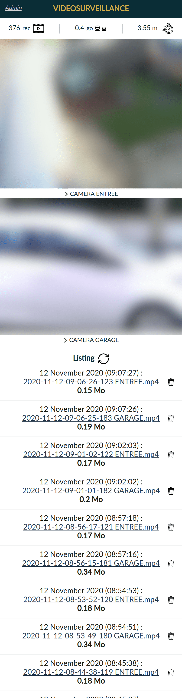

# Application web pour vidéosurveillance avec RaspberryPi et motion
Application web hébergée sur RaspberryPi, streaming de caméras grâce avec motion .
Quelques liens utiles pour installer motion sur RaspberryPi :

&nbsp;
[trevilly.com](https://trevilly.com/installation-de-motion-sur-raspberry-pi3/)

&nbsp;
[opendomotech.com](https://opendomotech.com/videosurveillance-avec-raspberry-pi-et-motion/)

Ce dépôt contient le code de l'application web, la gestion automatique des suppressions de fichiers, la notification par mail au déclenchement d'enregistrements (à personnaliser).

## Illustrations de l'application :


&nbsp;
## Fonctions principales :
* Affichage streaming live de deux caméras
* Affichage du listing des enregistrements vidéos
* Lecture des enregistrements dans la page
* Affichage en temps réel du nombre de fichiers d'enregistrements stockés sur le serveur
* Affichage en temps réel de la taille du dossier d'enregistrement (à personnaliser)
* Affichage en temps réel du time du dernier enregistrement
* Lien "fake" en cas d'accès non autorisés sur le serveur avec envoi de mail (fichier "mail_raspicam_acces_admin.py")
* Suppression automatique des enregistrements personnalisable (fichier "suppvideo2.py") à mettre en crontab sur le RaspberryPi
* Notification par mail à la fin d'un enregistrement si fichier > 4mo (à personnaliser)


&nbsp;
## Améliorations à prévoir :
* Actualisation en temps réel du listing des enregistrements (sans action manuelle), avec node.js pour l'envoi de données depuis le serveur
* Application gourmande en trafic réseau : node.js
* Affichage en temps réel de la température du processeur du RaspberryPi


&nbsp;
## Contributions :
Vous êtes tous les bienvenus :)
1. Fork
2.
```
git checkout -b developpement
git commit -am 'New feature'
git push origin developpement
```
3. Créer Pull Request
